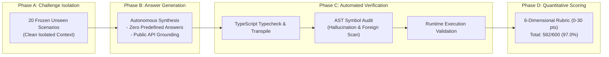

### Figure 10: Blind Developer Challenge Benchmark Pipeline

```mermaid
flowchart LR
  subgraph PhaseA["Phase A: Challenge Isolation"]
    CH["20 Frozen Unseen Scenarios\n(Clean Isolated Context)"]
  end

  subgraph PhaseB["Phase B: Answer Generation"]
    GEN["Autonomous Synthesis\n- Zero Predefined Answers\n- Public API Grounding"]
  end

  subgraph PhaseC["Phase C: Automated Verification"]
    TSC["TypeScript Typecheck & Transpile"]
    AST["AST Symbol Audit\n(Hallucination & Foreign Scan)"]
    RT["Runtime Execution Validation"]
  end

  subgraph PhaseD["Phase D: Quantitative Scoring"]
    SCORE["6-Dimensional Rubric (0-30 pts)\nTotal: 582/600 (97.0%)"]
  end

  CH --> GEN --> TSC --> AST --> RT --> SCORE
```
