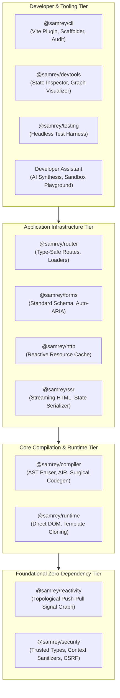

### Figure 1: Overall Samrey Architecture

```mermaid
flowchart TD
  subgraph T3["Developer & Tooling Tier"]
    CLI["@samrey/cli\n(Vite Plugin, Scaffolder, Audit)"]
    DEVTOOLS["@samrey/devtools\n(State Inspector, Graph Visualizer)"]
    TESTING["@samrey/testing\n(Headless Test Harness)"]
    ASSISTANT["Developer Assistant\n(AI Synthesis, Sandbox Playground)"]
  end

  subgraph T2["Application Infrastructure Tier"]
    ROUTER["@samrey/router\n(Type-Safe Routes, Loaders)"]
    FORMS["@samrey/forms\n(Standard Schema, Auto-ARIA)"]
    HTTP["@samrey/http\n(Reactive Resource Cache)"]
    SSR["@samrey/ssr\n(Streaming HTML, State Serializer)"]
  end

  subgraph T1["Core Compilation & Runtime Tier"]
    COMPILER["@samrey/compiler\n(AST Parser, AIR, Surgical Codegen)"]
    RUNTIME["@samrey/runtime\n(Direct DOM, Template Cloning)"]
  end

  subgraph T0["Foundational Zero-Dependency Tier"]
    REACTIVITY["@samrey/reactivity\n(Topological Push-Pull Signal Graph)"]
    SECURITY["@samrey/security\n(Trusted Types, Context Sanitizers, CSRF)"]
  end

  T3 --> T2
  T2 --> T1
  T1 --> T0
```
