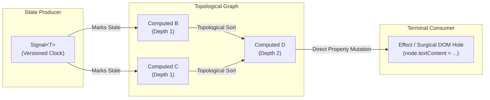

### Figure 2: Reactive Dependency and Update Flow

```mermaid
flowchart LR
  subgraph Producer["State Producer"]
    S["Signal&lt;T&gt;\n(Versioned Clock)"]
  end

  subgraph Derivations["Topological Graph"]
    C1["Computed B\n(Depth 1)"]
    C2["Computed C\n(Depth 1)"]
    D["Computed D\n(Depth 2)"]
  end

  subgraph Consumer["Terminal Consumer"]
    E["Effect / Surgical DOM Hole\n(node.textContent = ...)"]
  end

  S -->|Marks Stale| C1
  S -->|Marks Stale| C2
  C1 -->|Topological Sort| D
  C2 -->|Topological Sort| D
  D -->|Direct Property Mutation| E
```
