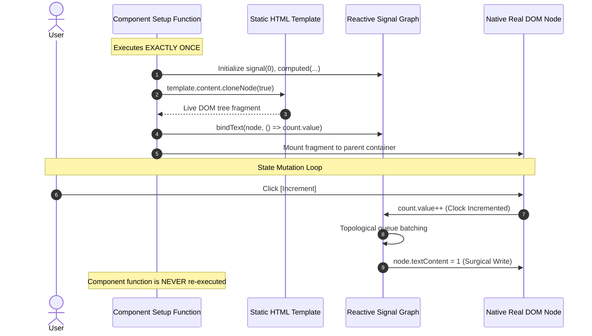

### Figure 3: Component Lifecycle & Surgical DOM Execution

```mermaid
sequenceDiagram
  autonumber
  actor User
  participant Comp as Component Setup Function
  participant Tmpl as Static HTML Template
  participant Graph as Reactive Signal Graph
  participant DOM as Native Real DOM Node

  Note over Comp: Executes EXACTLY ONCE
  Comp->>Graph: Initialize signal(0), computed(...)
  Comp->>Tmpl: template.content.cloneNode(true)
  Tmpl-->>Comp: Live DOM tree fragment
  Comp->>Graph: bindText(node, () => count.value)
  Comp->>DOM: Mount fragment to parent container
  
  Note over User,DOM: State Mutation Loop
  User->>DOM: Click [Increment]
  DOM->>Graph: count.value++ (Clock Incremented)
  Graph->>Graph: Topological queue batching
  Graph->>DOM: node.textContent = 1 (Surgical Write)
  Note over Comp: Component function is NEVER re-executed
```
