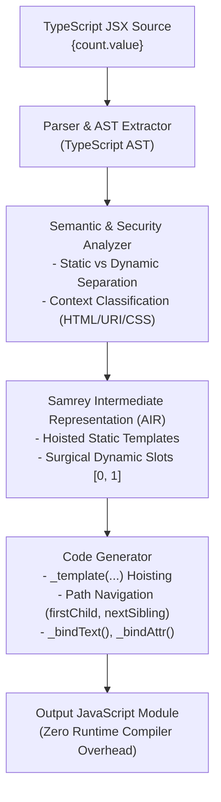

### Figure 4: Compiler to Runtime Execution Pipeline

```mermaid
flowchart TD
  SRC["TypeScript JSX Source\n<div>{count.value}</div>"]
  PARSER["Parser & AST Extractor\n(TypeScript AST)"]
  ANALYZER["Semantic & Security Analyzer\n- Static vs Dynamic Separation\n- Context Classification (HTML/URI/CSS)"]
  AIR["Samrey Intermediate Representation (AIR)\n- Hoisted Static Templates\n- Surgical Dynamic Slots [0, 1]"]
  CODEGEN["Code Generator\n- _template(...) Hoisting\n- Path Navigation (firstChild, nextSibling)\n- _bindText(), _bindAttr()"]
  OUTPUT["Output JavaScript Module\n(Zero Runtime Compiler Overhead)"]

  SRC --> PARSER --> ANALYZER --> AIR --> CODEGEN --> OUTPUT
```
