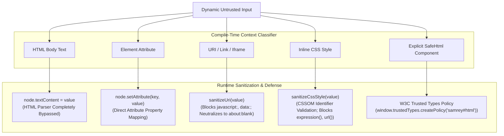

### Figure 6: Context-Aware Defensive Security Boundary

```mermaid
flowchart TD
  INPUT["Dynamic Untrusted Input"]

  subgraph Classifier["Compile-Time Context Classifier"]
    C_TEXT["HTML Body Text"]
    C_ATTR["Element Attribute"]
    C_URI["URI / Link / Iframe"]
    C_CSS["Inline CSS Style"]
    C_RAW["Explicit SafeHtml Component"]
  end

  subgraph Defense["Runtime Sanitization & Defense"]
    D_TEXT["node.textContent = value\n(HTML Parser Completely Bypassed)"]
    D_ATTR["node.setAttribute(key, value)\n(Direct Attribute Property Mapping)"]
    D_URI["sanitizeUri(value)\n(Blocks javascript:, data:; Neutralizes to about:blank)"]
    D_CSS["sanitizeCssStyle(value)\n(CSSOM Identifier Validation; Blocks expression(), url())"]
    D_RAW["W3C Trusted Types Policy\n(window.trustedTypes.createPolicy('samrey#html'))"]
  end

  INPUT --> C_TEXT --> D_TEXT
  INPUT --> C_ATTR --> D_ATTR
  INPUT --> C_URI --> D_URI
  INPUT --> C_CSS --> D_CSS
  INPUT --> C_RAW --> D_RAW
```
