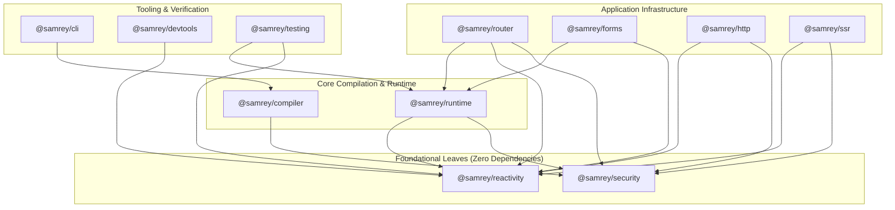

### Figure 7: Samrey Monorepo Package Dependency Topology

```mermaid
flowchart TD
  subgraph T3["Tooling & Verification"]
    CLI["@samrey/cli"]
    DEVTOOLS["@samrey/devtools"]
    TESTING["@samrey/testing"]
  end

  subgraph T2["Application Infrastructure"]
    ROUTER["@samrey/router"]
    FORMS["@samrey/forms"]
    HTTP["@samrey/http"]
    SSR["@samrey/ssr"]
  end

  subgraph T1["Core Compilation & Runtime"]
    COMPILER["@samrey/compiler"]
    RUNTIME["@samrey/runtime"]
  end

  subgraph T0["Foundational Leaves (Zero Dependencies)"]
    REACTIVITY["@samrey/reactivity"]
    SECURITY["@samrey/security"]
  end

  CLI --> COMPILER
  COMPILER --> SECURITY

  DEVTOOLS --> REACTIVITY
  TESTING --> RUNTIME
  TESTING --> REACTIVITY

  ROUTER --> RUNTIME
  ROUTER --> REACTIVITY
  ROUTER --> SECURITY

  FORMS --> RUNTIME
  FORMS --> REACTIVITY

  HTTP --> REACTIVITY
  HTTP --> SECURITY

  SSR --> REACTIVITY
  SSR --> SECURITY

  RUNTIME --> REACTIVITY
  RUNTIME --> SECURITY
```
