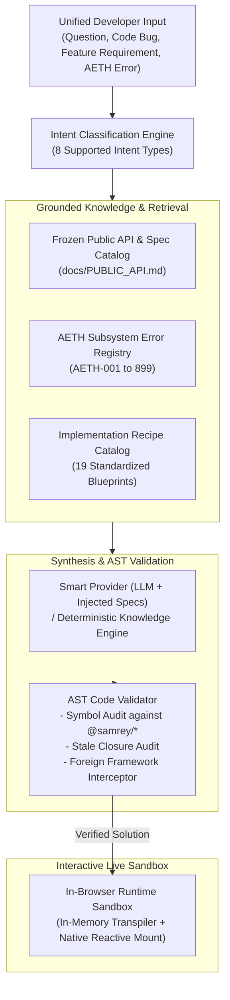

### Figure 8: Developer Assistant Architecture

```mermaid
flowchart TD
  INPUT["Unified Developer Input\n(Question, Code Bug, Feature Requirement, AETH Error)"]
  INTENT["Intent Classification Engine\n(8 Supported Intent Types)"]

  subgraph Retrieval["Grounded Knowledge & Retrieval"]
    KB["Frozen Public API & Spec Catalog\n(docs/PUBLIC_API.md)"]
    ERRORS["AETH Subsystem Error Registry\n(AETH-001 to 899)"]
    RECIPES["Implementation Recipe Catalog\n(19 Standardized Blueprints)"]
  end

  subgraph Synthesis["Synthesis & AST Validation"]
    SMART["Smart Provider (LLM + Injected Specs)\n/ Deterministic Knowledge Engine"]
    VALIDATOR["AST Code Validator\n- Symbol Audit against @samrey/*\n- Stale Closure Audit\n- Foreign Framework Interceptor"]
  end

  subgraph Sandbox["Interactive Live Sandbox"]
    PLAYGROUND["In-Browser Runtime Sandbox\n(In-Memory Transpiler + Native Reactive Mount)"]
  end

  INPUT --> INTENT
  INTENT --> Retrieval
  Retrieval --> Synthesis
  Synthesis --> VALIDATOR
  VALIDATOR -->|Verified Solution| PLAYGROUND
```
