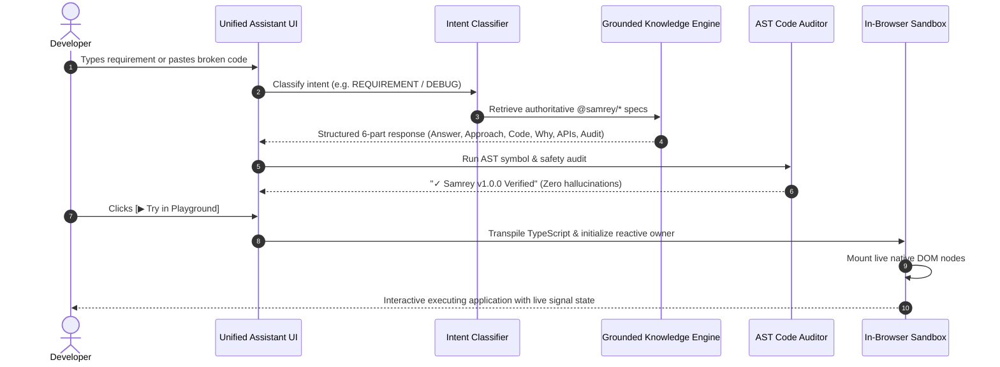

### Figure 9: Developer Workflow Pipeline

```mermaid
sequenceDiagram
  autonumber
  actor Dev as Developer
  participant UI as Unified Assistant UI
  participant Intent as Intent Classifier
  participant Engine as Grounded Knowledge Engine
  participant Audit as AST Code Auditor
  participant Sand as In-Browser Sandbox

  Dev->>UI: Types requirement or pastes broken code
  UI->>Intent: Classify intent (e.g. REQUIREMENT / DEBUG)
  Intent->>Engine: Retrieve authoritative @samrey/* specs
  Engine-->>UI: Structured 6-part response (Answer, Approach, Code, Why, APIs, Audit)
  UI->>Audit: Run AST symbol & safety audit
  Audit-->>UI: "✓ Samrey v1.0.0 Verified" (Zero hallucinations)
  Dev->>UI: Clicks [▶ Try in Playground]
  UI->>Sand: Transpile TypeScript & initialize reactive owner
  Sand->>Sand: Mount live native DOM nodes
  Sand-->>Dev: Interactive executing application with live signal state
```
